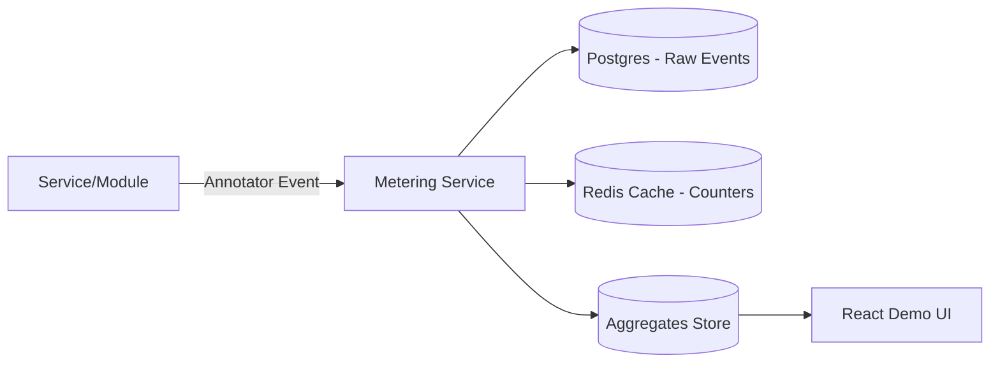

# **Business Requirements Document (BRD) – Detailed Version**

## **Project: Dynamic API-Driven Metering Framework**

## **Version: 1.0**

---

# **1. Introduction**

## **1.1 Purpose of the Document**

This Business Requirements Document (BRD) defines the functional and non-functional requirements of a **Dynamic, API-driven Metering Framework** that tracks, measures, and monitors usage of modules, features, and APIs in real time. The framework includes:

* **Metering Service (Backend API)**
* **Metering Annotator (Python Integration Layer)**
* **Demonstration UI (React + Tailwind + shadcn)**

The goal is to provide a **lightweight, plug-and-play metering solution** suitable for SaaS platforms, enterprise modules, microservices, and internal service monitoring.

---

# **2. Business Objectives**

* Enable real-time **usage monitoring** across multiple services.
* Allow systems to track **module access**, **feature consumption**, and **API usage** dynamically.
* Act as a foundational layer for **billing, cost governance, quota enforcement**, and **analytics**.
* Provide a **simple UI dashboard** for showcasing metering behavior during demos or stakeholder presentations.
* Minimize engineering effort required for integration through decorators and middleware.

---

# **3. Problem Statement**

Organizations adopting modular or microservices-based architecture need visibility into **who used what and how often**. Existing logging or monitoring tools track performance but do not provide **feature-level metering** for:

* Functional usage analytics
* Consumption-based billing
* Quota/limit enforcement
* Per-tenant usage insights
* Audit and reporting

This framework solves these gaps.

---

# **4. Scope Definition**

## **4.1 In Scope**

* REST API–based Metering Service
* Event ingestion (single & batch)
* Aggregates and usage analytics
* Quota/limit validation
* Python-based Metering Annotator
* Demo UI with dashboards, tables, and charts
* Local deployment references using Docker

## **4.2 Out of Scope (Phase 1 Prototype)**

* Invoicing/billing pipelines
* Complex multi-region distributed processing
* Multi-cloud deployment
* Enterprise-grade IAM or role-based access control

---

# **5. Stakeholders**

| Role               | Responsibility                          |
| ------------------ | --------------------------------------- |
| Product Owner      | Defines metering goals & priorities     |
| Backend Engineers  | Build Metering Service API              |
| Python Developers  | Integrate annotator & decorate modules  |
| Frontend Engineers | Build UI for visualization              |
| DevOps             | Deployment & reliability                |
| Finance/Business   | Uses usage analytics for pricing models |

---

# **6. High-Level Architecture**



---

# **7. Functional Requirements**

## **7.1 Metering Service (Backend API)**

### **7.1.1 Record Usage Events**

* System must support `POST /v1/meter/events` for ingesting events.
* Accept both **single** and **batch** events.
* Each event includes:

  * tenant_id
  * resource (module name)
  * feature (feature name)
  * quantity (default: 1)
  * metadata (JSON)
  * timestamp

### **7.1.2 Fetch Raw Events**

* System must provide `GET /v1/meter/events` with pagination.
* Support filtering by:

  * tenant_id
  * resource
  * feature
  * date range

### **7.1.3 Aggregates & Usage Queries**

* Provide endpoint `GET /v1/meter/aggregates`.
* Allow grouping by:

  * resource
  * feature
  * hourly/daily buckets
* Must compute aggregated counts for dashboards.

### **7.1.4 Quota/Limit Validation**

* Provide `POST /v1/meter/validate`.
* Validate whether a tenant can perform an action.
* Return:

```json
{
  "allowed": true,
  "remaining": 22,
  "limit": 100,
  "period": "monthly",
  "reset_at": "2025-12-01T00:00:00Z"
}
```

### **7.1.5 Event Processing & Batching**

* Must support batch ingestion worker for high-volume use.
* Batching configurable (time-based or count-based).

---

## **7.2 Metering Annotator (Python Integration)**

### **7.2.1 Decorator-based Integration**

* Developers must be able to annotate functions:

```python
@meter(resource="invoice.create", feature="pdf_export")
def generate_invoice(...):
```

### **7.2.2 Middleware-based Integration**

* Must support FastAPI/Flask/Starlette middleware.
* Automatically captures API-level usage.

### **7.2.3 Transport Modes**

* Sync (blocking call)
* Async fire-and-forget
* Background batching thread

### **7.2.4 Error Handling**

* Retries (max 3)
* Fallback to local queue if service is down

---

## **7.3 UI Requirements (React + Tailwind + shadcn)**

### **7.3.1 Dashboard Page**

* Total usage summary (cards)
* Usage trend chart (line graph)
* Top resources & features

### **7.3.2 Tenant Usage Page**

* Usage by tenant
* Quotas vs consumption
* Daily breakdown

### **7.3.3 Events Explorer**

* Tabular event viewer
* JSON viewer for metadata

### **7.3.4 API Key Management**

* Generate/delete API keys (static for prototype)

### **7.3.5 UI Technology Stack**

* React
* TailwindCSS
* shadcn/ui
* Recharts for graphs

---

# **8. Data Requirements**

## **8.1 Raw Event Schema**

| Field     | Type     | Description       |
| --------- | -------- | ----------------- |
| id        | UUID     | Unique event ID   |
| tenant_id | String   | Tenant identifier |
| resource  | String   | Module name       |
| feature   | String   | Feature name      |
| quantity  | Int      | Units consumed    |
| timestamp | datetime | Event time        |
| metadata  | JSONB    | Additional info   |

## **8.2 Aggregates Schema**

| Field          | Type     |
| -------------- | -------- |
| tenant_id      | String   |
| resource       | String   |
| feature        | String   |
| window_start   | datetime |
| window_end     | datetime |
| total_quantity | Int      |

## **8.3 Quota Configuration**

| Field           | Type       |
| --------------- | ---------- |
| tenant_id       | String     |
| feature         | String     |
| limit           | Int        |
| period          | Enum       |
| alert_threshold | Percentage |

---

# **9. Non-Functional Requirements**

## **9.1 Performance**

* Event ingestion must handle **1,000 events/sec** in prototype.
* API response times < 200ms for queries.

## **9.2 Scalability**

* Stateless Metering Service for horizontal scaling.
* Database partitioning by time (optional).

## **9.3 Availability**

* Prototype target: 99.5% uptime.

## **9.4 Security**

* API key–based auth.
* Input sanitization.
* Secure metadata handling.

## **9.5 Logging & Monitoring**

* Export Prometheus metrics.
* Capture API request/response logs.

---

# **10. Risks & Mitigation**

| Risk                   | Mitigation                      |
| ---------------------- | ------------------------------- |
| High event load        | Use batching & queueing         |
| Integration complexity | Provide decorators & middleware |
| Database growth        | Introduce archiving policy      |
| Latency spikes         | Caching aggregates in Redis     |

---

# **11. Assumptions**

* Services can call Metering API via HTTP.
* Prototype environment is Docker-based.
* UI does not require authentication beyond token.

---

# **12. Success Metrics**

* Metering Annotator integrated in ≤5 minutes.
* Events displayed on UI within ≤3 seconds.
* Quota validation accuracy: 100%.
* Demo dashboard loads within ≤2 seconds.

---

# **13. Deliverables**

* API-driven Metering Service (FastAPI recommended)
* Python Metering Annotator Library
* React UI (Tailwind + shadcn)
* Docker Compose environment
* Sample integration module
* Documentation & API examples

---

# **14. Appendix**

## **14.1 Example Event Payload**

```json
{
  "tenant_id": "org_001",
  "resource": "billing",
  "feature": "invoice_generate",
  "quantity": 1,
  "timestamp": "2025-11-20T10:31:00Z",
  "metadata": {"user": "u_123", "order": "ord_456"}
}
```

## **14.2 Example Decorator Usage**

```python
@meter(resource="billing", feature="invoice_generate", quantity=1)
def process_invoice(order_id):
    ...
```

---

If you want, I can also generate:

* **HLD**
* **LLD**
* **API Spec (Swagger style)**
* **Full demo code scaffolding**
