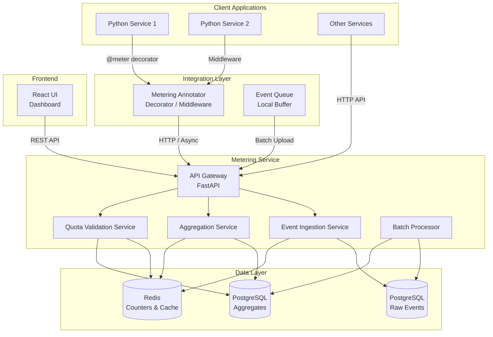

# **High-Level Design (HLD) Document**
## **Dynamic API-Driven Metering Framework**

**Version:** 1.0  
**Date:** 2025-11-20  
**Status:** Draft

---

## **1. Executive Summary**

This document outlines the high-level architecture and design of the Dynamic API-Driven Metering Framework. The system provides real-time usage tracking, aggregation, and quota validation capabilities for SaaS platforms, enterprise modules, and microservices.

---

## **2. System Architecture Overview**

### **2.1 Architecture Diagram**



### **2.2 Component Overview**

| Component | Technology | Purpose |
|-----------|-----------|---------|
| Metering Service | FastAPI (Python) | Core REST API for event ingestion, queries, validation |
| Metering Annotator | Python Library | Integration layer with decorators and middleware |
| Frontend UI | React + Tailwind + shadcn | Dashboard and visualization |
| Primary Database | PostgreSQL | Raw events and aggregates storage |
| Cache Layer | Redis | Real-time counters and query caching |
| Batch Processor | Python Worker | Background processing for high-volume events |

---

## **3. System Components**

### **3.1 Metering Service (Backend API)**

**Technology Stack:**
- **Framework:** FastAPI
- **Language:** Python 3.11+
- **Database ORM:** SQLAlchemy
- **Cache:** Redis (redis-py)
- **Async Support:** asyncio, aiohttp
- **Validation:** Pydantic

**Key Responsibilities:**
1. Event ingestion (single and batch)
2. Event querying with filters
3. Aggregation computation
4. Quota validation
5. API authentication (API keys)

**Deployment:**
- Containerized with Docker
- Stateless design for horizontal scaling
- Environment-based configuration

### **3.2 Metering Annotator (Python Library)**

**Technology Stack:**
- **Language:** Python 3.8+
- **Dependencies:** requests, aiohttp (optional)
- **Framework Support:** FastAPI, Flask, Starlette

**Key Responsibilities:**
1. Decorator-based function instrumentation
2. Middleware for automatic API tracking
3. Event buffering and batching
4. Retry logic and error handling
5. Async/sync transport modes

**Integration Modes:**
- **Decorator:** `@meter(resource="...", feature="...")`
- **Middleware:** Automatic route tracking
- **Direct API:** Manual event submission

### **3.3 Frontend UI (React Dashboard)**

**Technology Stack:**
- **Framework:** React 18+
- **Styling:** TailwindCSS
- **Components:** shadcn/ui
- **Charts:** Recharts
- **HTTP Client:** Axios
- **State Management:** React Query (TanStack Query)

**Key Responsibilities:**
1. Dashboard visualization
2. Tenant usage analytics
3. Events explorer
4. API key management
5. Real-time data refresh

### **3.4 Data Storage**

#### **3.4.1 PostgreSQL**

**Purpose:** Persistent storage for raw events and aggregates

**Schemas:**
- `metering_events` - Raw event storage
- `metering_aggregates` - Pre-computed aggregates
- `metering_quotas` - Quota configurations
- `metering_api_keys` - API authentication

**Indexing Strategy:**
- Primary indexes on `tenant_id`, `resource`, `feature`
- Time-based indexes on `timestamp`
- Composite indexes for common query patterns

#### **3.4.2 Redis**

**Purpose:** High-speed caching and real-time counters

**Data Structures:**
- **Strings:** Counter values (tenant:resource:feature:period)
- **Hashes:** Aggregate snapshots
- **Sorted Sets:** Time-windowed rankings
- **TTL:** Automatic expiration for time-based windows

---

## **4. Data Flow**

### **4.1 Event Ingestion Flow**

```
1. Client Application
   ↓
2. Metering Annotator (decorator/middleware)
   ↓
3. Event Validation & Enrichment
   ↓
4. Metering Service API (/v1/meter/events)
   ↓
5. Write to PostgreSQL (raw event)
   ↓
6. Update Redis counters (real-time)
   ↓
7. Trigger aggregation (async, if needed)
   ↓
8. Return response to client
```

### **4.2 Aggregation Flow**

```
1. Scheduled Job / On-Demand Trigger
   ↓
2. Query PostgreSQL for time window
   ↓
3. Compute aggregates (group by tenant/resource/feature)
   ↓
4. Store in PostgreSQL (metering_aggregates)
   ↓
5. Update Redis cache (for fast queries)
   ↓
6. Invalidate old cache entries
```

### **4.3 Quota Validation Flow**

```
1. Client Request (POST /v1/meter/validate)
   ↓
2. Load quota configuration (from DB or cache)
   ↓
3. Query current usage (Redis counter or DB aggregate)
   ↓
4. Compare usage vs limit
   ↓
5. Return validation result (allowed/remaining/limit)
```

### **4.4 Query Flow (Dashboard)**

```
1. UI Request (GET /v1/meter/aggregates)
   ↓
2. Check Redis cache
   ↓
3. If cache miss: Query PostgreSQL aggregates
   ↓
4. Compute on-the-fly if aggregates missing
   ↓
5. Cache result in Redis
   ↓
6. Return to UI
```

---

## **5. Technology Choices & Rationale**

### **5.1 Backend: FastAPI**

**Rationale:**
- High performance (async support)
- Automatic OpenAPI documentation
- Type safety with Pydantic
- Easy integration with Python ecosystem
- Built-in async/await support

### **5.2 Database: PostgreSQL**

**Rationale:**
- ACID compliance for critical data
- JSONB support for flexible metadata
- Excellent indexing capabilities
- Mature ecosystem
- Time-series extensions available

### **5.3 Cache: Redis**

**Rationale:**
- Sub-millisecond latency
- Built-in TTL for time-windowed data
- Rich data structures (counters, sorted sets)
- Pub/sub for real-time updates (future)
- Industry standard for caching

### **5.4 Frontend: React + Tailwind + shadcn**

**Rationale:**
- React: Component-based, large ecosystem
- Tailwind: Rapid UI development
- shadcn: High-quality, accessible components
- Recharts: Flexible charting library

---

## **6. Scalability & Performance**

### **6.1 Horizontal Scaling**

- **Stateless API:** All state in databases
- **Load Balancing:** Multiple API instances behind LB
- **Database Connection Pooling:** SQLAlchemy connection pools
- **Redis Connection Pooling:** Shared connection pools

### **6.2 Performance Optimizations**

- **Batch Processing:** Accumulate events before DB writes
- **Async Writes:** Non-blocking event ingestion
- **Caching Strategy:** Aggressive Redis caching for aggregates
- **Database Indexing:** Strategic indexes for query patterns
- **Connection Pooling:** Reuse DB/Redis connections

### **6.3 Capacity Planning**

| Metric | Target | Notes |
|--------|--------|-------|
| Event Ingestion | 1,000 events/sec | Per instance, scalable horizontally |
| API Response Time | <200ms | P95 latency |
| Cache Hit Rate | >80% | For aggregate queries |
| Database Connections | 20-50 per instance | Configurable pool size |

---

## **7. Security Architecture**

### **7.1 Authentication**

- **API Key Authentication:** Header-based (`X-API-Key`)
- **Key Storage:** Hashed in database
- **Key Rotation:** Manual (Phase 1), automated (future)

### **7.2 Authorization**

- **Tenant Isolation:** Events scoped by `tenant_id`
- **Input Validation:** Pydantic models for all inputs
- **SQL Injection Prevention:** ORM-based queries
- **Rate Limiting:** Per API key (future enhancement)

### **7.3 Data Security**

- **Encryption at Rest:** Database-level encryption
- **Encryption in Transit:** HTTPS/TLS
- **Metadata Sanitization:** Validate JSON payloads
- **Audit Logging:** Track API key usage

---

## **8. Deployment Architecture**

### **8.1 Containerization**

```yaml
Services:
  - metering-api (FastAPI)
  - postgres (Database)
  - redis (Cache)
  - metering-ui (React, served via Nginx)
  - batch-worker (Optional, for high volume)
```

### **8.2 Docker Compose Structure**

```
metering/
├── docker-compose.yml
├── services/
│   ├── api/
│   ├── ui/
│   └── worker/
├── databases/
│   └── migrations/
└── config/
    └── env.example
```

### **8.3 Environment Configuration**

- **Development:** Local Docker Compose
- **Staging:** Single server with containers
- **Production:** Orchestrated (Kubernetes/Docker Swarm) - Future

---

## **9. Monitoring & Observability**

### **9.1 Metrics (Prometheus)**

- **API Metrics:** Request count, latency, error rate
- **Event Metrics:** Ingestion rate, batch size
- **Database Metrics:** Query time, connection pool usage
- **Cache Metrics:** Hit rate, memory usage

### **9.2 Logging**

- **Structured Logging:** JSON format
- **Log Levels:** DEBUG, INFO, WARNING, ERROR
- **Log Aggregation:** stdout (container logs)

### **9.3 Health Checks**

- **API Health:** `/health` endpoint
- **Database Health:** Connection check
- **Redis Health:** Ping check
- **Dependencies:** All services health status

---

## **10. Error Handling & Resilience**

### **10.1 Retry Strategy**

- **Client Side (Annotator):** Exponential backoff, max 3 retries
- **Server Side:** Idempotent operations, graceful degradation

### **10.2 Fallback Mechanisms**

- **Local Queue:** Annotator buffers events if API unavailable
- **Cache Fallback:** Serve stale data if DB unavailable
- **Circuit Breaker:** Prevent cascade failures (future)

### **10.3 Data Consistency**

- **Eventual Consistency:** Aggregates computed asynchronously
- **Idempotency:** Event IDs prevent duplicates
- **Transaction Boundaries:** Critical writes in transactions

---

## **11. Future Enhancements (Out of Scope for Phase 1)**

1. **Multi-region Deployment:** Geographic distribution
2. **Streaming Processing:** Kafka integration for real-time
3. **Advanced Analytics:** ML-based usage predictions
4. **Webhook Notifications:** Quota threshold alerts
5. **GraphQL API:** Alternative query interface
6. **Multi-tenancy Isolation:** Database-level separation
7. **Event Replay:** Reprocessing historical events

---

## **12. Dependencies & Integrations**

### **12.1 External Dependencies**

- PostgreSQL 14+
- Redis 6+
- Python 3.11+
- Node.js 18+ (for UI)

### **12.2 Python Packages (Core)**

- fastapi
- uvicorn
- sqlalchemy
- psycopg2-binary
- redis
- pydantic
- python-multipart

### **12.3 Python Packages (Annotator)**

- requests
- aiohttp (optional)
- tenacity (retries)

---

## **13. API Gateway & Routing**

### **13.1 API Versioning**

- **Base Path:** `/v1/meter/...`
- **Version Strategy:** URL-based versioning
- **Backward Compatibility:** Maintain v1 during v2 development

### **13.2 Endpoint Structure**

```
/v1/meter/
  ├── events (POST, GET)
  ├── aggregates (GET)
  ├── validate (POST)
  ├── quotas (GET, POST, PUT, DELETE)
  └── health (GET)
```

---

## **14. Data Retention & Archival**

### **14.1 Retention Policy**

- **Raw Events:** 90 days (configurable)
- **Aggregates:** 1 year (configurable)
- **Archival:** Move to cold storage (future)

### **14.2 Cleanup Jobs**

- **Scheduled Tasks:** Daily cleanup of expired data
- **Partitioning:** Time-based table partitioning (future)

---

## **15. Testing Strategy**

### **15.1 Unit Tests**

- Service layer logic
- Annotator decorator behavior
- Validation functions

### **15.2 Integration Tests**

- API endpoints
- Database operations
- Redis interactions

### **15.3 End-to-End Tests**

- Full event ingestion flow
- Dashboard data display
- Quota validation scenarios

---

## **16. Documentation Requirements**

1. **API Documentation:** OpenAPI/Swagger spec
2. **Integration Guide:** Annotator usage examples
3. **Deployment Guide:** Docker Compose setup
4. **Architecture Diagrams:** Component interactions
5. **Troubleshooting Guide:** Common issues and solutions

---

**Document Status:** Ready for Review  
**Next Steps:** Proceed to Low-Level Design (LLD)

